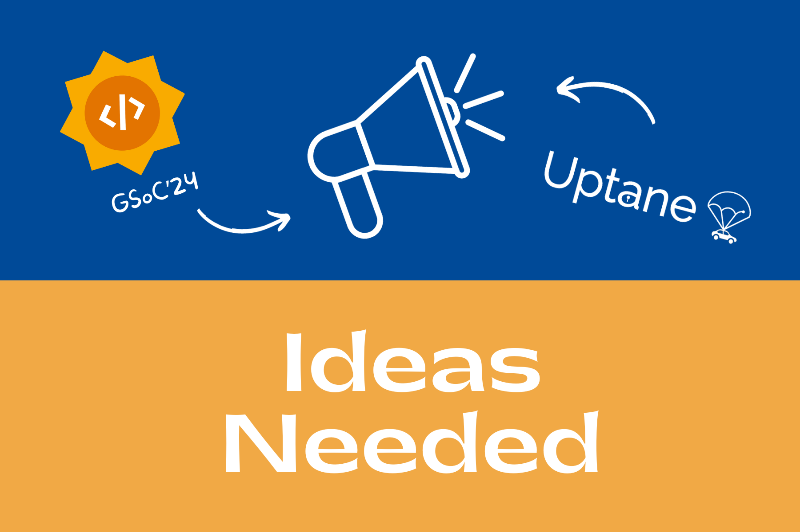

# Title: Exciting Opportunities Await: Uptane Calls for GSoC 2024 Idea List Submissions!

Greetings, Uptane community 👋!

As the dawn of Google Summer of Code (GSoC) 2024 ☀️ approaches, we're thrilled to announce a call for idea list submissions. Jon Oster has already put forth two compelling proposals, and we're eager to expand this list with your innovative ideas. Before diving into the details of Jon's proposals, let's encourage everyone to participate in the discussion and contribute fresh perspectives on our [GitHub discussion board](https://github.com/uptane/uptane.github.io/discussions/166).

Now, let's explore the exciting projects proposed by Jon Oster:

## Proposal 1: Integrating aktualizr with Popular Embedded Software Updaters 🔄

Aktualizr, a Uptane client written in C++, focuses on embedded Linux systems. Uptane's core functionality is vital for securing and validating software updates in highly security-sensitive and safety-critical systems. However, aktualizr currently supports only OSTree as a method for installing updates.

This GSoC project aims to enhance aktualizr by implementing support for an A/B partition-based update method. Swupdate or RAUC, two popular open-source software updaters, are the targeted integration points. While libaktualizr already supports additional package managers, collaboration with the maintainers of Swupdate or RAUC would be ideal.

**Key skills required:** Systems-level programming in C++

**Potential mentors:** Jon Oster, Patti Vacek, Phil Wise, Rogerio Borin, Phil Lapczynski, Person-to-be-named-later from SWUpdate or RAUC project.

## Proposal 2: Creating an Open-Source Web UI for OTA Community Edition  🌐

Uptane's project already boasts open-source implementations of core back-end services. However, setting up and using these services can be challenging. OTA Community Edition provides a simplified, docker-based deployment method, but lacks a crucial component - a user-friendly UI.

This GSoC project seeks to develop a new, simplified UI from scratch and integrate it into OTA Community Edition. The goal is to enable ordinary users to interact with the system seamlessly. Additionally, the project should include a robust test suite to ensure the UI remains functional with any upstream changes in the core services.

**Key skills required:** Front-end/UI development, automated testing, CI/CD

**Potential mentors:** Jon Oster, Temi Adeyeri, [Mentor to be named]

## Join the Discussion and Share Your Ideas 🗣️

If you have any other amazing ideas to contribute, feel free to join the discussion on our [GitHub board](https://github.com/uptane/uptane.github.io/discussions/166). Remember, the deadline for submitting your ideas is January 22. We encourage your participation in shaping the official project list for GSoC registrations.

Let's make Uptane GSoC 2024 ☀️ a collaborative success 🚀!
